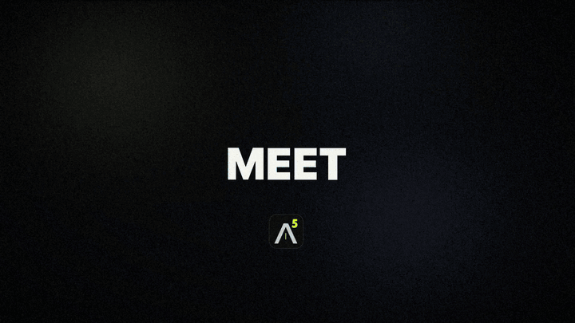

<h1 align="center">AtherScreenshot</h1>

<p align="center">
  <b>Capture. Mark up. Find. Edit video.</b><br>
  A tiny, native screenshot and screen-recording app for <b>macOS</b> and <b>Windows</b>.<br>
  No sign-in, no bloat, no dependencies.
</p>

<p align="center">
  <a href="#download">Download</a> ·
  <a href="#features">Features</a> ·
  <a href="#default-shortcuts">Shortcuts</a> ·
  <a href="#guide">Guide</a> ·
  <a href="#build-from-source">Build</a> ·
  <a href="macos/README.md">macOS docs</a>
</p>

<p align="center">
  <a href="marketing/AtherScreenshot-hype.mp4"></a>
  <br>
  <a href="marketing/AtherScreenshot-hype.mp4"><b>▶ Watch the 60-second video (with sound)</b></a>
</p>

## Download

Version **0.0.2** for macOS and Windows. Both update themselves from inside the app.

| Platform | Download | Size | Requirements |
|---|---|---|---|
| **macOS** | [**AtherScreenshot-0.0.2-macOS.dmg**](https://github.com/AskTinNguyen/AtherScreenshot/releases/download/v0.0.2/AtherScreenshot-0.0.2-macOS.dmg) | 4.0 MB | macOS 14+, Apple silicon and Intel |
| **Windows** | [**AtherScreenshot-Setup-0.0.2.exe**](https://github.com/AskTinNguyen/AtherScreenshot/releases/download/v0.0.2/AtherScreenshot-Setup-0.0.2.exe) | 2.7 MB | Windows 10/11, x64 |
| Windows (portable) | [AtherScreenshot-0.0.2-portable.zip](https://github.com/AskTinNguyen/AtherScreenshot/releases/download/v0.0.2/AtherScreenshot-0.0.2-portable.zip) | 1.2 MB | Windows 10/11, x64, no install |

Checksums: [macOS](https://github.com/AskTinNguyen/AtherScreenshot/releases/download/v0.0.2/SHA256SUMS-macOS.txt) · [Windows](https://github.com/AskTinNguyen/AtherScreenshot/releases/download/v0.0.2/SHA256SUMS.txt) · All files are on the [v0.0.2 release page](https://github.com/AskTinNguyen/AtherScreenshot/releases/tag/v0.0.2); earlier ones on [v0.0.1](https://github.com/AskTinNguyen/AtherScreenshot/releases/tag/v0.0.1).

**First launch.** The builds aren't signed yet, so your OS asks once:

| | What to do |
|---|---|
| **macOS** | Drag the app to Applications and open it once. Then go to System Settings › Privacy & Security › **Open Anyway**. Allow Screen Recording when asked. |
| **Windows** | When SmartScreen says "Windows protected your PC", click **More info › Run anyway**, then **INSTALL**. Installing is per-user and needs no admin. See [INSTALL.md](INSTALL.md). |

## Features

| | |
|---|---|
| 📸 **Capture** | Region, window, full screen, scrolling pages, delay timer, screen ruler, color picker, OCR text, and auto-redaction of emails, keys and card numbers |
| ✏️ **Annotate** | Arrows, shapes, text, steps, highlighter, blur and pixelate, spotlight, magnifier, crop and styled export |
| 🧩 **Compose** | Drop screenshots into screenshots, extend the canvas for notes, and make collages in one key |
| 🎥 **Record** | MP4 with system audio and mic, or GIF; follows a window; shows clicks, keystrokes and your game controller |
| 🎬 **Edit video** | Trim, crop, speed, join several videos, auto captions, callouts, emoji, blur, zoom and title cards, with animations (fade, pop, slide, typewriter); any video, not just your recordings |
| 🗂️ **Gallery** | Tags, collections, smart folders, ratings, duplicates, find similar, version stacks and before/after compare |
| 🔎 **Smart search** | Suggested tags, related-word search ("graph" finds charts), dates ("last week") and text inside images |
| ☁️ **Share** | Copy to clipboard, pin to screen, optional upload (Imgur, custom endpoint or S3) |
| ⌨️ **Automate** | Command palette, rebindable shortcuts, command line and `atherscreenshot://` links |

OCR, tags and search run on your computer. Upload is off until you set it up. Auto captions are transcribed on the device too; on a Mac without on-device speech recognition, macOS uses Apple's servers.

## Default shortcuts

| Action | macOS | Windows |
|---|---|---|
| Command palette (every command) | `⌃⌥K` | `Ctrl+Alt+K` |
| Capture region | `⌃⌥4` | `PrintScreen` |
| Capture all displays / current display | `⌃⌥3` / `⌃⌥⇧3` | `Ctrl+PrintScreen` / `Ctrl+Shift+PrintScreen` |
| Capture active window | `⌃⌥W` | `Alt+PrintScreen` |
| Capture and annotate | `⌃⌥E` | `Ctrl+Alt+E` |
| Scrolling capture | `⌃⌥S` | `Ctrl+Alt+S` |
| Capture and upload | `⌃⌥U` | `Ctrl+Alt+U` |
| Capture gallery | `⌃⌥H` | `Ctrl+Alt+H` |
| Record MP4 / GIF (press again to stop) | `⌃⌥5` / `⌃⌥G` | `Shift+PrintScreen` / `Ctrl+Alt+PrintScreen` |

macOS reserves `⌘⇧3/4/5`, so the Mac defaults use `⌃⌥`. In the gallery and editors, `Ctrl` on Windows replaces `⌘` on the Mac.

Everything is configurable in the **Settings** window (palette → "Settings", or the tray menu):
- **Searchable:** type to filter the settings.
- **Saved instantly:** every change applies right away, no restart.
- **Reset:** right-click any setting to reset it.
- **Shortcuts:** click a shortcut field and press the keys (Esc cancels, Backspace clears). A shortcut already used by another command moves over to the new one. A shortcut taken by another app or Windows shows a warning on its row.

Values are stored in `%APPDATA%\AtherScreenshot\settings.ini` on Windows, and in UserDefaults (`com.ather.screenshot`) under the same key names on the Mac.

## Guide

This guide describes the Windows app. The Mac app works the same way; its docs and permissions are in [macos/README.md](macos/README.md), and the differences are listed under [Platform differences](#platform-differences).

### Capturing

- **Region selector:** click snaps to the window or monitor under the cursor, drag selects a region, `Space` takes the monitor, `Ctrl+A` takes everything, arrows nudge 1 px (`Shift` = 10 px), `Esc` or right-click cancels.
- **Scrolling capture:** select the scrollable area. The app scrolls it with the mouse wheel and stitches the frames, keeping sticky headers and footers only once. It stops at the end, on `Esc`, or after `[Scrolling] MaxFrames`.
- **Screen ruler:** drag to measure W × H, length and angle (`Shift` snaps). Drag again for a new measurement; `C` copies it.
- **Auto-redact:** "Capture region with auto-redact", or `AutoRedact=1` for every capture. It runs OCR and pixelates emails, IPs, API keys/tokens/JWTs, card numbers (Luhn-checked) and phone numbers. It can only redact what Windows OCR reads; it skipped a line of repeated `1111` digits in testing, so check important redactions.
- **File names:** `FileNameTemplate` with `{yyyy} {MM} {dd} {HH} {mm} {ss} {ms} {app} {window} {w} {h}`. `AskForName=1` prompts after each capture; "Rename last capture…" renames afterwards.

### Annotation editor

Open it with `Ctrl+Alt+E`, by clicking the capture toast, from the gallery, from a pin's menu, with "Open a picture or video to edit…", or with `AtherScreenshot.exe edit <file>`. Pictures and videos from anywhere work too: the installer adds Ather Screenshot to Explorer's "Open with" and an "Edit with Ather Screenshot" item to the right-click menu (videos open in the video editor). Edits are saved as new files in your captures; the original is never changed.

| Key | Tool |
|---|---|
| `V` | Select: drag to move, `Delete` removes, `Ctrl+D` duplicates |
| `A` `L` `R` `E` `P` | Arrow, line, rectangle, ellipse, pen (`Shift` snaps) |
| `H` `T` `N` | Highlighter, text, step numbers |
| `B` `X` | Blur, pixelate |
| `S` | Spotlight: dims everything outside the areas you drag |
| `M` | Magnifier: drag from a detail to where the 2× bubble goes |
| `C` | Crop |
| `K` | Canvas: add space around the screenshot |
| `I` | Insert image |
| `1`–`8`, `[` `]`, wheel | Color, size |

Other shortcuts:
- `Ctrl+Z`/`Ctrl+Y` undo/redo, `Ctrl+C` copy, `Ctrl+S` save, `Ctrl+P` pin, `Enter` Done (copy + save + close).
- `Ctrl+R` auto-redact (adds editable pixelate boxes).
- `Ctrl+E` styled export: gradient backdrop, padding, rounded corners and a shadow.
- `Ctrl+Shift+C` / `Ctrl+Shift+V` copy or paste annotations between editors.
- `Ctrl+K` lists every editor command.

#### Editor extras

- **Insert image (I):** drop a screenshot from the gallery or Explorer onto the editor, paste one with `Ctrl+V`, or press I to pick from recent captures.
  - It becomes a layer: drag to move, drag a corner to resize (`Shift` for free resize), and `Ctrl+]` / `Ctrl+[` to bring it forward or send it back.
  - Right-click it for rounded corners, shadow, border, opacity and actual size.
  - Blur and pixelate apply to layers too. Everything is flattened when you save.
- **Canvas (K):** drag any edge to add space around the screenshot (`Alt` moves both sides), or use Space below, Space right and Even margin.
  - The space is filled with the screenshot's edge color, white, black or transparent (saved as a 32-bit PNG).
  - Text wraps at the canvas edge, so notes in the margin stay on the image.
- **Collage (`Ctrl+G` in the gallery):** select two or more screenshots and press Collage.
  - Choose a layout (auto, grid, row, column, feature), gap, margin, background, corners, shadow and size (fit, 1920 px wide, square).
  - Drag one screenshot onto another to swap them; everything else in the editor works on top.
- **Saved results join the gallery:**
  - Edits are tagged "edited" and keep the original's metadata.
  - Collages are tagged "collage" and keep the tags and collections their screenshots share.
  - Both list the screenshots they include.

### Recording

Select a region, or use "Record a window", which follows one window wherever it moves, even when it's covered. A 3-2-1 countdown runs first (click it to cancel). The control bar has Pause/Resume, Stop and Discard. The bar, frame and countdown never appear in the video.

- **Capture:** frames come from Windows.Graphics.Capture (GPU), falling back to GDI for regions that span monitors or when `GpuCapture=0`.
- **MP4:** H.264 with the hardware encoder when available, plus AAC audio of the system sound (`RecordSystemAudio`) and/or the microphone (`RecordMicrophone`), mixed and kept in sync. Pauses are cut out.
- **GIF:** per-frame palettes; identical frames are merged.
- **Click and keystroke overlay:** click ripples (`ShowClicks`) and a keystroke pill (`ShowKeys`, off by default because it would show anything you type, including passwords).
- **Game controller overlay:** with "Show game controller" on (`ShowGamepad`), a connected Xbox-style (XInput) controller is drawn in a corner of the video, like OBS's Input Overlay: a white controller whose sticks move, triggers fill and buttons light up as you use them. Pick the corner with `GamepadCorner` and how visible it is with "Controller opacity" (`GamepadOpacity`, 10–100%). Nothing is drawn while no controller is connected. PlayStation controllers show up when Steam Input or DS4Windows presents them as XInput.
- When a recording finishes, the file is copied to the clipboard so you can paste it into chats.

### Video editor

Opening a video (from the gallery, the "Recording saved" notification, Open recent in the palette, "Open a picture or video to edit…", or Explorer) opens a small editor instead of a player. MP4, MOV, M4V, WMV, AVI and MKV work; phone videos recorded sideways show upright.

- **Trim:** drag the yellow handles on the timeline, or press I and O at the playhead.
- **Join videos:** Add ▾ › Video clip… (Ctrl+O), or drop video files on the editor, to add them after the selected clip. Clips play back to back; videos of another shape get black bars.
  - Once there's more than one clip, a clip lane shows above the timeline: click a clip to select it, drag it to reorder, and drag a selected clip's edges to trim it.
  - S splits the clip at the playhead (then remove a middle part, or reorder the halves). The selected clip's row has Split, Earlier, Later and Remove (Del).
  - Markup and captions move with the footage they're on; undo covers clip changes too.
- **Crop:** press C and drag on the video; pick Free, 16:9, 4:3, 1:1 or 9:16 to keep a shape.
- **Speed** 0.5–4× (audio keeps its pitch) and **Mute**.
- **Captions:**
  - T adds one at the playhead. Type in the field, drag it on the timeline to move it or its edges to retime it, and choose top, middle or bottom.
  - **Auto captions** transcribes the speech on this PC with Windows speech recognition and splits it into short captions.
  - If no recognizer is installed for your language, it says so and points to Settings › Time & language › Speech.
- **Markup (Add ▾):**
  - Kinds: text, speech bubbles, emoji (quick picks; Win+. in the field for any other), arrows, boxes, ellipses, step numbers, blur or pixelate (to hide private info for a stretch of time), zoom (smoothly zooms into a box, shown while playing) and full-screen title cards.
  - Each item has its own bar on the timeline: drag to move, drag its edges to retime.
  - On the video, drag to move and drag the handles to resize.
  - Shortcuts: A arrow, R box, E emoji, N step, X blur, Z zoom.
- **Animation:** one menu per item.
  - "Auto" picks a sensible style for the kind: arrows and boxes draw on, emoji and bubbles pop, text slides up, title cards fade.
  - Or choose Fade, Pop, Scale, Slide up, Wipe, Blur in, Draw on or Typewriter, which plays in and out.
  - Optional while on screen: Pulse, Bounce, Shake or Ping.
  - Advanced: a different exit, and apply to all items of the same kind.
  - ▶ replays the item.
- **Captions ▾** sets captions for the whole video: look (pill, outline or bar), animation, size (five steps), text color, box or outline color, and highlighting the spoken word (auto captions). The same style controls show when a caption is selected.
- **Placing captions:** drag a caption on the video to place it anywhere; Top, Middle and Bottom snap it back to a preset.
- **Preview:** the preview and the export use the same frame renderer, so what you see is what's saved. While paused, the selected item is shown fully rather than mid-animation, so a new caption is visible at the playhead.
- **Saving:**
  - **Save** (`Ctrl+S`) writes a new MP4 (H.264 + AAC).
  - **Save GIF** (`Ctrl+Shift+S`) writes a GIF (12 fps, at most 960 px).
  - The original stays untouched, and the result stacks with it in the gallery.

Space plays, ←/→ step a frame (`Shift`: a second), `Del` deletes the selected item, `Ctrl+Z` undoes, `Esc` leaves crop, then deselects, then closes.

### Capture gallery

`Ctrl+Alt+H`. An Eagle-style library for everything in the captures folder. Metadata lives in `%APPDATA%\AtherScreenshot\library.json`, in the same format as the Mac app's, and image features in `features.bin`. The image files are never modified.

- **Organize:**
  - Tags (T) and collections (F, or drag captures onto a collection). A capture can be in several collections, and a collection can add tags automatically to everything dropped into it.
  - Smart folders save the current search and filters as a live folder.
  - Star ratings (1–5, 0 clears), comments, and batch rename (`{n} {name} {date} {app}`).
  - Duplicates finds identical or near-identical captures, with "keep newest, trash the rest".
- **Search:**
  - Text matches the file name, OCR text, tags, comments, source app and window title.
  - Filters cover type, tags (all/any/untagged), rating, color, shape (landscape, portrait, square, panorama, long page), minimum dimensions, date, file size and source app.
  - **Find similar** is a reverse image search on a perceptual hash plus a color and structure fingerprint.
- **Layout:**
  - The window is just your captures under one toolbar (scope menu, search, filters, view options).
  - Filter chips appear only while a filter is active, and an action bar floats in while something is selected.
  - The sidebar (`Ctrl+B`) and the details inspector (`Ctrl+I`) stay hidden until you ask for them.
- **Browse:**
  - Justified, grid or list layout; `Ctrl+=` / `Ctrl+−` change the thumbnail size.
  - Sort by date, name, size, dimensions, rating or random (shuffle).
  - The inspector shows tags, rating, comment, collections, the color palette (click a color to search by it), info and OCR text.
  - Space opens a full-window preview with zoom, playback for GIFs and videos, ←/→ navigation and a slideshow.
  - Drag captures out to other apps, or drop files in to import them.
- **Suggested tags:**
  - Each capture gets suggestions from its source app, the text in it, its shape and colors (code, terminal, error, chat, email, design, web, receipt, login, dashboard, mobile, dark…).
  - They're searchable right away.
  - Click one to add it, right-click to stop suggesting it, or turn on Settings › Gallery › Tag captures automatically.
- **Search by meaning:**
  - Words also match related words from a curated screenshot vocabulary: "graph" finds charts, "login" finds sign-in screens.
  - Phrases like "yesterday" or "last week" filter by date.
  - Related matches come after exact ones.
- **Versions:**
  - An edited capture stacks with its original; the badge shows how many versions there are and opens the stack.
  - C compares two captures (or an edit with its original) with a before/after slider or side by side.
- **Indexing:**
  - Dimensions, palette, perceptual hash, image fingerprint and OCR text are computed in the background, and a small progress ring shows in the toolbar.
  - New and moved files are picked up as they appear.
  - Captures remember which app and window they came from.

<details>
<summary><b>Gallery keyboard shortcuts</b></summary>

| Key | Action |
|---|---|
| Space | Preview (←/→ next/previous, Space/Esc close) |
| T / F | Add tags / add to collection |
| 1–5, 0 | Rate / clear rating |
| Enter | Annotate, edit video, or open |
| C | Compare |
| `Ctrl+F` or `/` | Search |
| `Ctrl+A`, `Shift`+arrows, `Ctrl`/`Shift`+click | Select several |
| `Ctrl+C` `Ctrl+T` `Ctrl+P` `Ctrl+R` `Ctrl+U` `Ctrl+O` `Del` | Copy, copy text, pin, rename/batch rename, upload, show in Explorer, Recycle Bin |
| `Ctrl+G` | Make a collage |
| `Ctrl+Shift+S` | Save the filters as a smart folder |
| `Ctrl+I` / `Ctrl+B` | Toggle the inspector / sidebar |
| `Ctrl+/` or `?` | Keyboard shortcuts |
| `Ctrl+K` | All actions |

</details>

### Upload

Set `[Upload] Uploader=` to one of:
- `imgur` + `ImgurClientId`
- `custom`: a multipart POST to `CustomUrl` with optional `CustomHeaders` (`Name: value; Name2: value2`). The link comes from the JSON path `CustomResponseUrl` (e.g. `data.link`), or from the plain-text body if that's empty.
- `s3`: AWS S3, Cloudflare R2, MinIO… signed with SigV4. Uses `S3Endpoint`, `S3Bucket`, `S3Region`, the keys, and an optional `S3PublicUrl`.

The link is copied to the clipboard. You can also set `AfterCapture=upload`.

### Updates (Windows)

From 0.0.2, the Windows app updates itself; earlier versions need one manual download.
- **Checks:** about a minute after it starts and then once a day, it reads `latest.json` from the newest [GitHub Release](https://github.com/AskTinNguyen/AtherScreenshot/releases/latest). Nothing else is sent. Turn this off in Settings › Updates (`[Updates] CheckAutomatically=0`); "Check for updates…" in the tray menu and the palette checks now.
- **Installing:** when there's a newer version, a notification offers it, and the tray menu shows "Update to version …". Click and it downloads the new exe (about 3 MB) in the background, checks its size, SHA-256 and the version inside it, swaps it in and restarts. Settings, captures and the gallery stay; there's no installer window and no admin prompt. It waits while you're recording or have an editor open.
- **Safety:** it only downloads over HTTPS from this repository on GitHub, and if anything fails it keeps the version you have and offers the download page instead.

### Command line and links

```
AtherScreenshot.exe region|fullscreen|monitor|window|last|scroll|ruler|ocr|color
                    record|gif|recordwindow|stop|pause|history|palette|folder|quit
                    [--pin|--edit|--upload|--redact|--ocr] [--delay N]
AtherScreenshot.exe edit|pin|upload <file>
start atherscreenshot://region?pin
```

Any `[Hotkeys]` key name works as a command too (e.g. `CaptureRegionPin`). If the app is already running, the command goes to that instance, so you can drive it from AutoHotkey, Stream Deck, scripts, or "Open with".

Commands typed in a terminal run directly. Commands from `atherscreenshot://` links (which any web page can open) or from tools without a console ask for confirmation first. They can never upload, or open, pin or edit files, even when "After capture" is set to upload.

## Platform differences

How the Windows app differs from the Mac app:

- **Shortcuts:**
  - Ctrl replaces ⌘.
  - The gallery sidebar is `Ctrl+B`, because `Ctrl+Shift+S` saves a smart folder.
  - PrintScreen, Pause and ScrollLock work as shortcuts on their own; other keys need Ctrl, Alt or Win.
- **Gallery:**
  - Find similar uses a perceptual hash plus a color and structure fingerprint, because Windows has no built-in image feature print.
  - Related words come from a curated vocabulary only, without an on-device word model.
  - Windows process names (msedge, Code, WindowsTerminal…) count as the matching apps for suggested tags.
  - The library is scanned a few seconds after startup, so the app starts instantly.
  - The window is opaque dark rather than translucent.
- **Video editor:**
  - Auto captions use Windows speech recognition (SAPI dictation), on this PC.
  - The emoji field uses Win+. for the full picker.
  - The selected item shows fully while paused (the Mac version shows its first, faded frame).
- **Recording:**
  - System audio and microphone are mixed into one AAC track (two tracks on the Mac).
  - The game controller overlay reads XInput pads (Xbox and compatible; PlayStation through Steam Input or DS4Windows). The Mac reads Xbox, PlayStation and MFi pads directly.
- **Updates:** Windows swaps the exe; the Mac swaps the app bundle, and only from the Applications folder (not from the disk image).

## Build from source

**Windows** (Visual Studio with the C++ workload, found automatically through vswhere):

```
build.bat          # release -> build\AtherScreenshot.exe
build.bat debug
```

**macOS** (Xcode or the Command Line Tools):

```
cd macos
./build.sh            # release -> build/Ather Screenshot.app
./build.sh package    # universal DMG and zip in dist/
xcrun swift test
```

### Package for the team (Windows)

```
package.bat            # -> dist\AtherScreenshot-Setup-<ver>.exe, -portable.zip, SHA256SUMS.txt, INSTALL.md
package.bat publish    # also puts them on the GitHub Release v<version> and writes downloads\latest.json
```

- **Shipping an update:** bump the version in `src/version.h`, or for a re-release of the same version raise `ATHER_VERSION_BUILD`/`ATHER_BUILD_STR` (the version people see stays the same; the updater compares the build). Then `set UPDATE_NOTES=One line about what's new`, run `package.bat publish`, and commit and push `downloads\latest.json` (copies before build 0.0.2.1 read it there). Running copies find the update within a day, or right away with "Check for updates…". Binaries live on GitHub Releases, not in the repo.
- **Setup exe:** the exe is its own installer. Run it from anywhere and it offers INSTALL (per-user, no admin), UPDATE, or "Run without installing". Install adds a Start menu shortcut, an optional startup entry, and an uninstall entry in Settings › Apps (which runs `AtherScreenshot.exe --uninstall`). Captures and settings are kept on uninstall.
- **Version:** bump it in `src/version.h`. The exe metadata, the installer and the file names all follow it.
- **Icon:** `res/app.ico` is generated from the vector A⁵ logo in `src/logo.cpp`. Delete the file and `build.bat` regenerates it.
- **Signing:** builds aren't code-signed, so teammates see a SmartScreen "unknown publisher" prompt the first time. With a code-signing certificate, `set SIGN_PFX=…` and `set SIGN_PASSWORD=…` before `package.bat` to sign.
- **Dev builds:** `build\AtherScreenshot.portable` marks the dev build folder as portable, so `build\AtherScreenshot.exe` runs in place without offering to install.


<details>
<summary><b>Project layout (Windows source)</b></summary>

- `src/main.cpp`: commands, hotkeys, tray, capture pipeline, CLI and links.
- **Capture and recording:**
  - `overlay`: region, color picker, ruler
  - `recorder`: MP4/GIF sessions
  - `wgc`: GPU capture
  - `audio`: WASAPI
  - `inputviz`: click and key overlay
  - `scroll`: scrolling capture
  - `capture`
- **Gallery:**
  - `library`: library.json, indexer, folder watching, filters
  - `smart`: suggested tags, related words, dates
  - `gallery_model`: selection, stacks, layouts
  - `gallery`: the window
  - `json`
- **Editors:**
  - `editor`: annotation, image layers, canvas
  - `collage`: layouts
  - `videoedit`: the video model and the frame renderer
  - `videoio`: decode, export, preview playback, speech to text
  - `videoeditor`: the window
  - `textdraw`: DirectWrite text
  - `annot.h`: the shared drawing code
- **UI and output:**
  - `palette`: Ctrl+K and the text prompt
  - `toast`, `pin`, `settingsui`
  - `output`: clipboard, PNG, naming
  - `media`: image and video decoding, MP4/GIF writers
  - `ocr`: text, words, redaction
  - `upload`: Imgur, custom, S3
  - `settings`
- **Tests:** `AtherScreenshot.exe --selftest [filter]` or `test.bat [--nobuild] [filter]`. Tests use a temporary support folder and never touch `%APPDATA%`.

</details>
